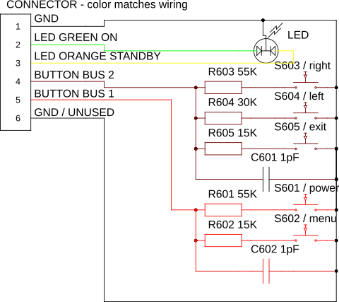
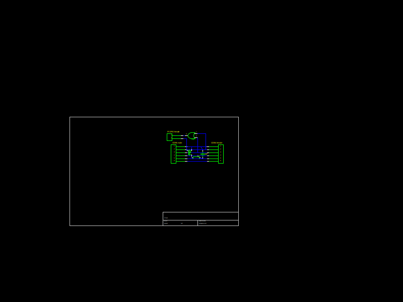

# kodi.gpio.pseudodpms

DPMS emulation via switching the monitor off & on with gpio.
Disclaimer: Your monitor wiring can be different, be extremely
careful not to damage your wiring. You might need to make your
own schematics, suitable for your hardware.

## Motivation and wiring

This addon is motivated by use of Raspberry PI 3 + LibreElec (Kodi JeOS).
The issue of such solution is, that Raspberry PI essentialy cannot
utilize the CEC/DPMS features over HDMI-to-DVI connected monitors,
such as mine Lenovo L2440p. However, it's okay with monitor turning
off and on again. 

Therefore, I decided to use RPI's GPIO to switch the monitor off and on again.

First of all, the monitor controls consists of single PCB with 
orange/green LED and 5 control buttons. The PCB is connected to monitor
with 6-pin 2mm connector. However, only 5 lines of the connector are
used - the 6th line is not handled.

In order to switch the buttons via GPIO, I've created a small parasite,
which I attached inbetween the controller PCB and monitor cable.
One GPIO pin is used to toggle the monitor ON/OFF state, the other
is used to read the current ON/OFF state.

Finally, if you use Raspberry PI 3 (as I do), you need to pick unoccupied
GPIO pins. In my setup, the toggle pin is logical 17 (physical 11)
and sense pin on logical 27 (physical 13).

## Logic outline
As the Raspberry PI is not the only SBC running LibreELEC, I decided not
to use the PI-speciffic libraries. Thus, this addon uses GPIO subsystem
accessed via /sys/class/gpio with individual exported GPIO pins.

## Configuration
The addon offers following configuration options:
* Toggle duration - how long to keep logical 1 on the switch pin.
* Use sense for toggle control - whether to read current monitor state
and toggle only if needed.
* Sense pin logical ID.
* Toggle pin logical ID.
